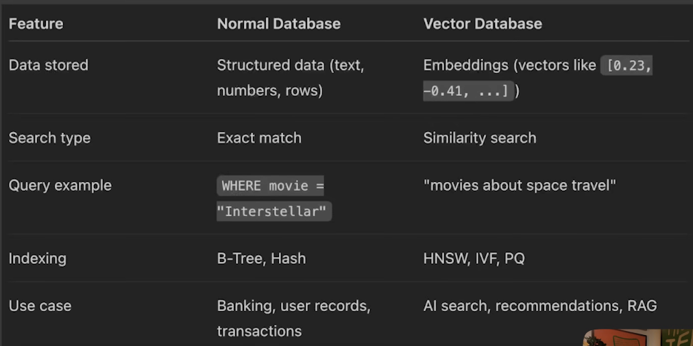
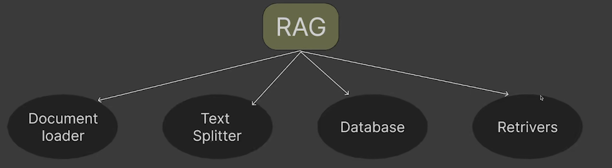
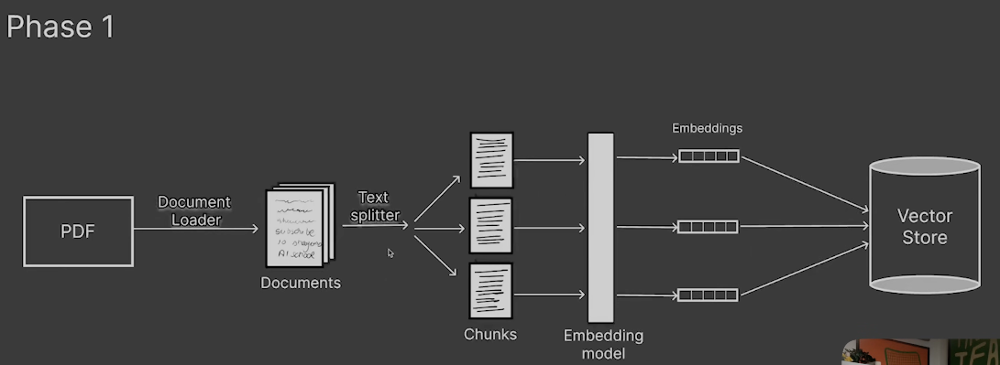
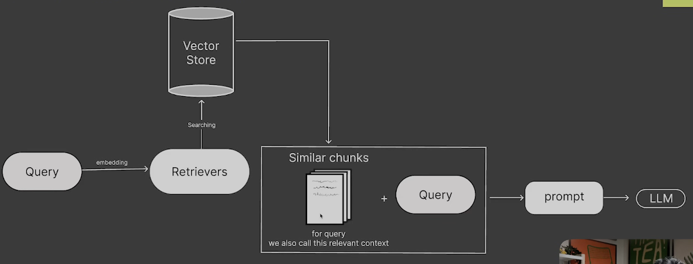

## Project Intro
CourseMate AI is an AI-powered study assistant designed to help students interact with their learning materials (notes, pdf, research papers) more efficiently. These documents are often long and difficult to navigate which makes time consuming to find specific information.
It allows students to chat with their study materials, so they can simply ask questions and receive accurate answers with reference links.

By leveraging RAG, courseMate AI combines document retrieval with LLM to provide context-aware explanations, summaries and answers from student study resource.

## Development Plan
Step1: Upload study material such as pdf, lecture notes, research papers

Step2: Document Loader - 
Convert raw files into document objects by cleaning (remove extra space, punctuation etc) using document loaders.
Langchain Lib used - pyPdf, ref- https://docs.langchain.com/oss/python/integrations/document_loaders

Step3: Text splitter (aka Chunking)
Documents are usually too large for LLM context windows and they can't take infinite tokens so for that split into chunks, else it will hit token limit.
Types - 
1. Character based - Split by fixed character specified. Not used now.
2. Recusrsive based - 
3. Token based - Chunks created based on specified token size. Example, if size is 2 then two words form one token, if 1 then one words will form token. I think tiktoken technique used.
4. Semantic/ Meaning Based splitting - It creates chunks based on meaning and structure of the text.

Step4: Embedding Generation
Each chunk converted into a vector embedding with embedding models which transform text into numerical vectors.
While creating embeddings, you have to provide dimension (length) of each embedding.

Step5: Vector DB storage - All embedding, text chunks, metadata are stored inside a vector database.
Why use Vector DB (Chroma, FAISS, Annoy, Amazon OpenSearch, there are tons) & why not mysql etc? - In normal DB, data stored is structured and searches works based on indexing, it will search record one by one and it will be time consuming. On the other hand, vector db uses Approximate nearest neighbour algorithm like - HNSW, IVF, PQ and do similarity search.

Step6: User asks question
So when we ask question, it will create question embedding & search that embedding via similarity search.

Step7: Retrievers
It will retrieve most relevant chuks from vector db and selects the top-k relevant chunks.
Types:
1. By Data source - With retrievers, you can fetch data from wikipedia, pubmed, Arxiv etc.
2. By retrieval strategy - Using similarity search (Mostly used), MultiQuery, MMR etc.

Step8: send to LLM - Send this context to LLM, which will answer.

## End to End RAG picture
Phase 1: You will load pdf with document loader, then split into chunks, then generate embedding using embedding model and then store in vector DB.

Phase 2: User will ask query, then generate embedding of that query, then with the help of retrievers (use some searching algorithm like similarity search etc) which search in vector db, then it will returns most relevant chunks (it can be multiple relative chunks, top 5 etc) and then combine those top 5 chunks plus query and pass it to prompt template (where you will decide role etc) so that LLM behaves good and response well.
